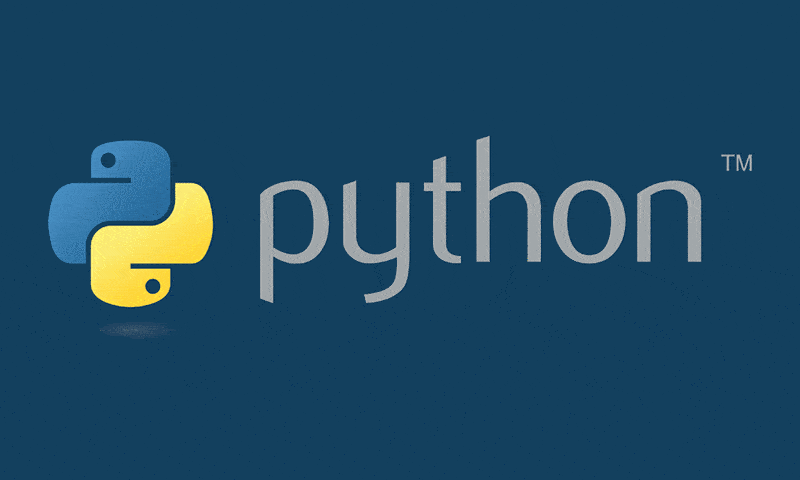

# Treinamento de Python

O Treinamento de Python é um projeto desenvolvido pelo Laboratório de
Instrumentação Eletrônica e Controle (LIEC) e pelo Programa de Educação Tutorial
de Engenharia Elétrica da Universidade Federal de Campina Grande (PET Elétrica
UFCG), que tem como objetivo principal, durante a sua execução, desenvolver
habilidades relacionadas a linguagem de programação Python, com foco em
aplicações para engenheiros e para cientistas.

Todo conteúdo produzido neste notebook foi adaptado por Rafael dos Santos Lima e por Tâmara Ruth Dantas dos Santos.

---

Para mais informações e/ou sanar eventuais dúvidas, entrar em contato com:
*   Rafael - rafaelsantos.lima@ee.ufcg.edu.br
*   Tâmara - tamara.santos@ee.ufcg.edu.br
